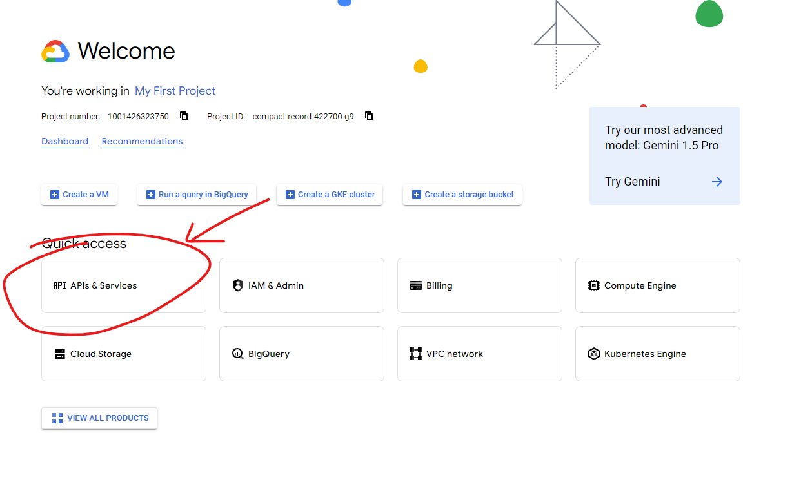
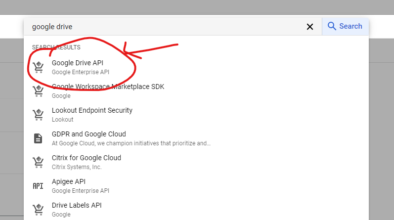
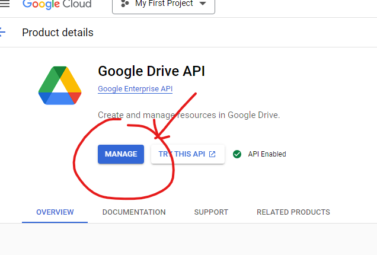
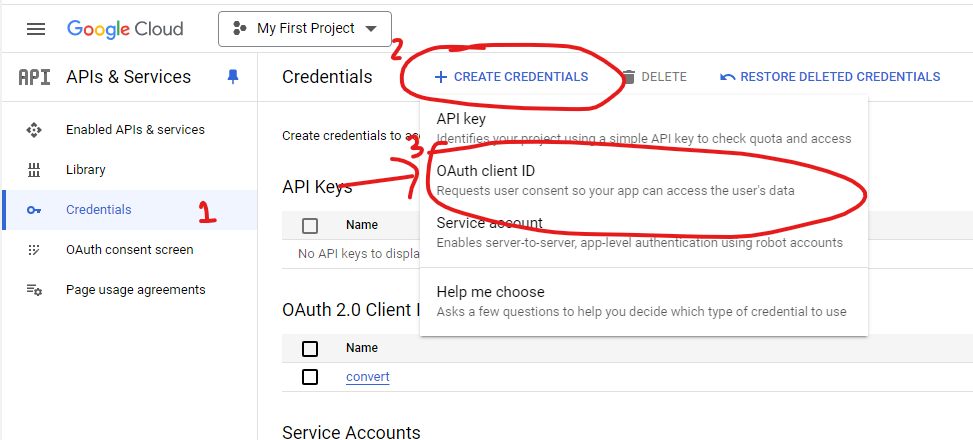
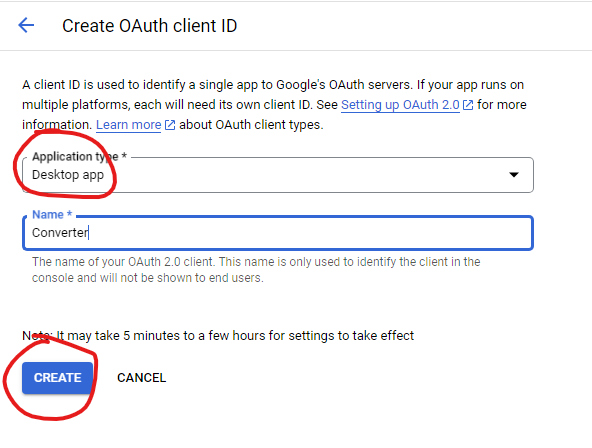
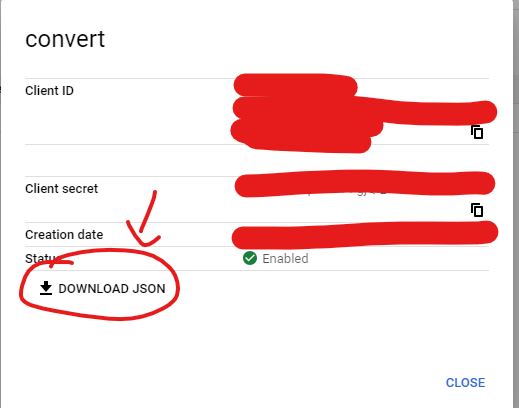
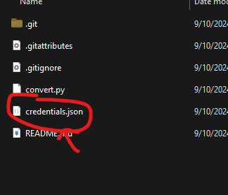
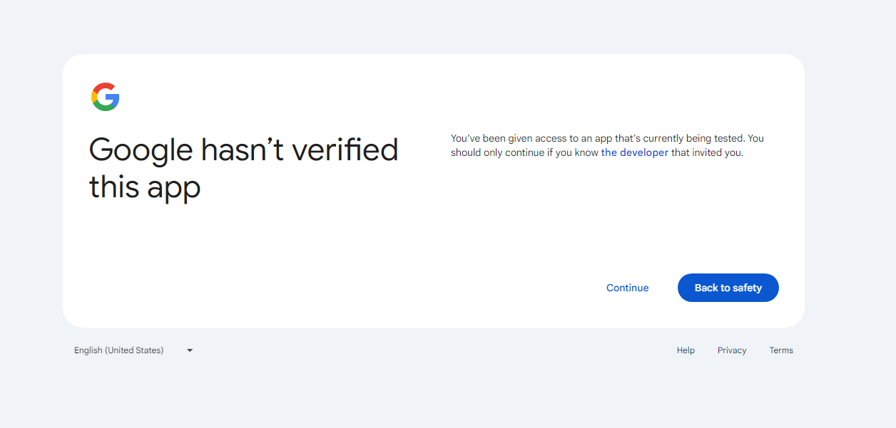

# gdrive-to-m365  
**A converter for Google Docs, Sheets, and Slides files to Microsoft Office formats (DOCX, XLSX, PPTX)**

## Overview

This program helps you convert Google Drive files (Google Docs, Sheets, and Slides) into Microsoft Office-compatible formats (DOCX, XLSX, and PPTX). It automates downloading these files, even if you're not the owner, allowing you to work with them in Microsoft Office applications like Word, Excel, and PowerPoint.

The app features a user-friendly GUI with options to:
- Convert Google Docs to DOCX
- Convert Google Sheets to XLSX
- Convert Google Slides to PPTX
- Search through subfolders and preserve folder structure during conversion

## Installation

Before running the program, ensure you have all the necessary dependencies installed. You can install them by running the following command:

```bash
pip install customtkinter google-auth google-auth-oauthlib google-auth-httplib2 google-api-python-client
```

## Google API Setup

Before using the program, you need to enable the **Google Drive API** and create the necessary credentials. Follow these steps to set it up:

### Step 1: Enable Google Drive API

  
From the Google Cloud Console, click on **"APIs & Services"** from the main dashboard.

### Step 2: Search for Google Drive API

  
Search for **"Google Drive API"** and click on it.

### Step 3: Activate the API

  
Click **"Enable"** to activate the API. If you've already activated it, you'll see "Manage."

### Step 4: Create OAuth Credentials

  
1. Navigate back to the **"APIs & Services"** page.
2. Click the **"Credentials"** tab.
3. Select **"Create Credentials"** and choose **"OAuth Client ID"**.

### Step 5: Choose Application Type

  
Under **Application Type**, select **"Desktop App"**. Name it however you like (e.g., "Converter").

### Step 6: Download the Credentials

  
Once created, click **"Download JSON"** to download the OAuth credentials.

### Step 7: Save Credentials

  
Rename the downloaded JSON file to **`credentials.json`** and place it in the same directory as the Python script.

You're now ready to use the program!

## Running the Program

After setting up the credentials, run the script, and a GUI will appear. The GUI allows you to:

- **Select Input Folder**: Choose the folder containing your `.gdoc`, `.gsheet`, or `.gslides` files.
- **Select Output Folder**: Choose where you want to save the converted files.
- **Conversion Options**: Choose which file types you want to convert (Google Docs, Sheets, or Slides). By default, all options are selected.
- **Search Subfolders**: If enabled, the program will search through subfolders and preserve the original folder structure when saving the converted files.

Simply click **Run**, and the program will convert all selected Google file types to their respective Microsoft Office formats.

## First-Time Setup Warning

During the first run, you might see a warning like this:



This is expected since your app is in testing mode. Click **"Continue"** and proceed to sign in with your Google account. This process is required to generate the necessary authentication files (`token.json`). You will only need to do this once.

## Notes
- You **cannot distribute** the generated `token.json` file with the program, as it contains user-specific credentials. Each user needs to generate their own token after authenticating.
- The program supports batch conversion, making it ideal for users who want to move multiple Google Drive files into Microsoft Office quickly and efficiently.
